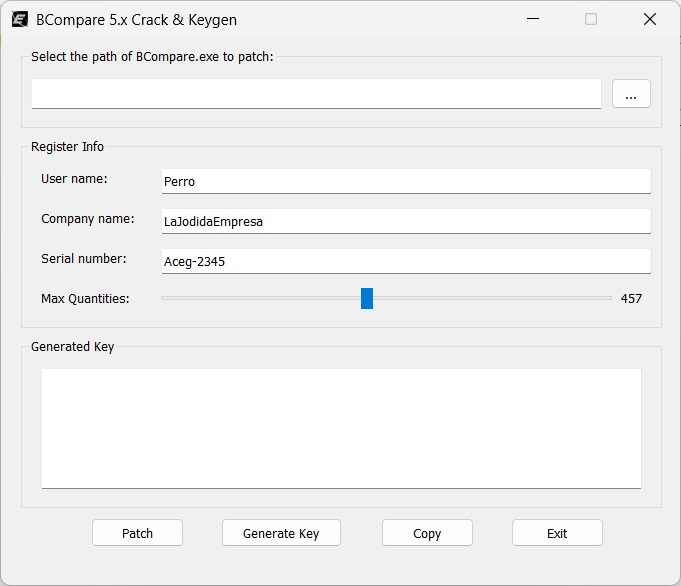

# BC5KeyGen_GUI
Aplicación GUI escrita en C++ y Qt para parchear binarios y generar credenciales para BeyondCompare 5.x.

## Exención de Responsabilidad
El diseño del algoritmo y la implementación del programa se proporcionan únicamente con fines educativos. Se prohíbe su uso comercial; de lo contrario, usted asumirá toda la responsabilidad por las consecuencias.

## Screenshot

